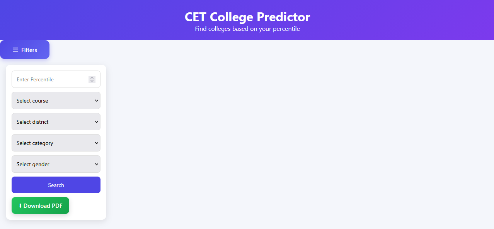
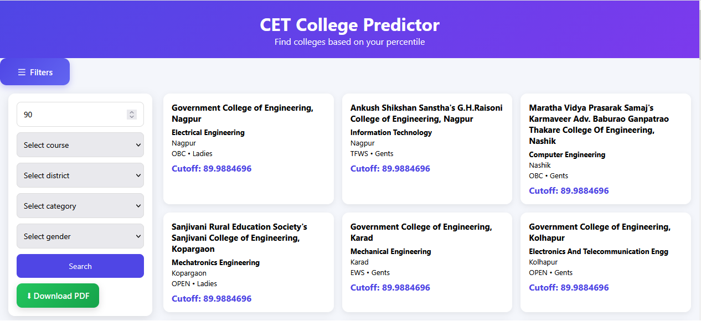

# 🎓 CollegeFind – MHT-CET College Cutoff Finder

**CollegeFind** is a web app that helps students explore engineering colleges in Maharashtra based on MHT-CET cutoff data and caste categories.

## 🌐 Live Demo
👉 [collegefind.netlify.app](https://collegefind.netlify.app)

## 🛠 Tech Stack
- HTML5
- CSS3
- JavaScript
- JSON (for cutoff data)
- Hosted on Vercel

## 🚀 Features
- 🎯 Search for engineering colleges using MHT-CET percentile
- ⚡ Super fast and responsive design
- 📊 Supports real 2024 cutoff data
- 📱 Mobile-friendly layout
- Colleges with percentile ≤ your score

## 📸 Screenshots
  

